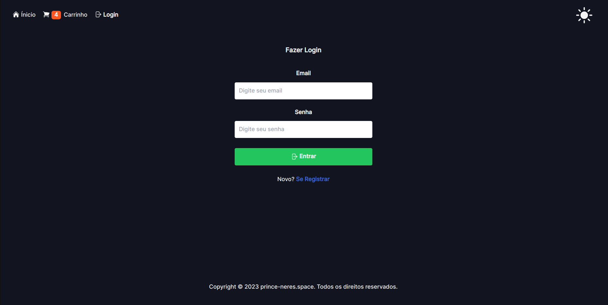
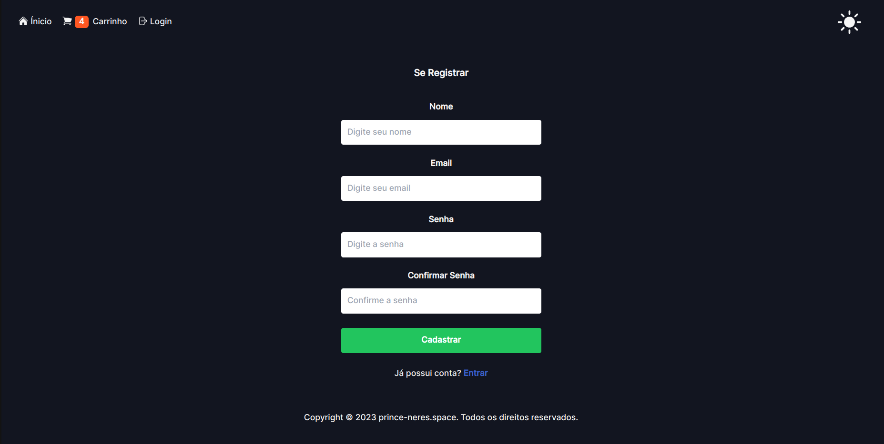
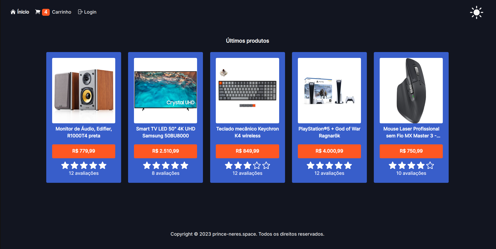
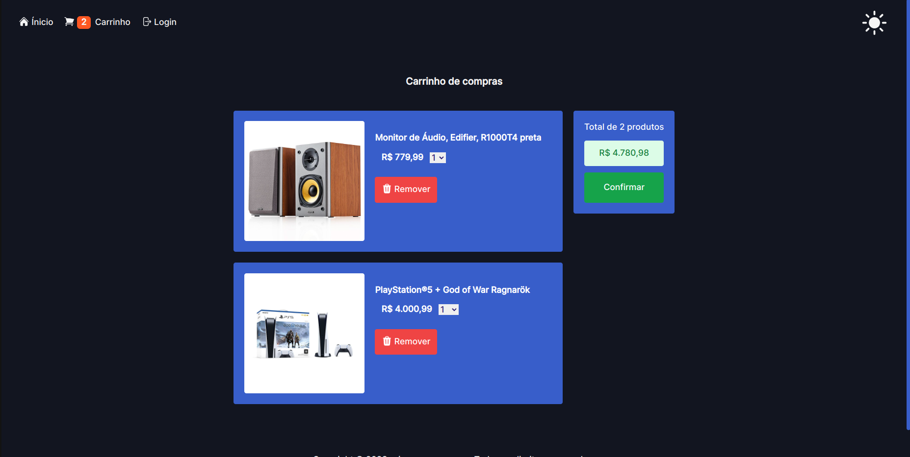

# Sistema de ecommerce
Projeto feito como meio para práticar habilidades.

## Como rodar passpo a passo:
1. Clone o projeto com `git clone https://github.com/prince-neres/ecommerce.git`
2. Entre no diretório do projeto com `ecommerce `

### Com Docker
1. `docker-compose up --build`

## Preview:
<h3 align="center">Login</h3>

  

<h3 align="center">Cadastrar-se</h3>

  

<h3 align="center">Página Inicial</h3>

  

<h3 align="center">Carrinho</h3>

  

 

## Tecnologias utilizadas:
### Front-end
* [Vite](https://vitejs.dev/guide/)
* [React.js](https://pt-br.reactjs.org/)
* [Tailwind CSS](https://tailwindcss.com/)
* [Hero Icons](https://heroicons.com/)
* [React Router DOM](https://reactrouter.com/en/main/start/overview)
* [Redux](https://redux.js.org/)

### Back-end
* [Django](https://www.djangoproject.com/)
* [Drango REST Framework](https://www.django-rest-framework.org/)
* [Django REST Framework JWT](https://django-rest-framework-simplejwt.readthedocs.io/en/latest/)

### Banco de Dados
* [PostgreSQL](https://www.postgresql.org/)